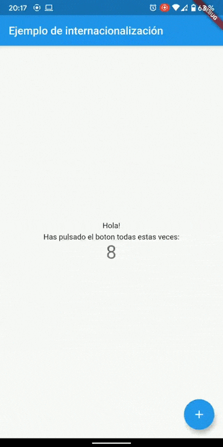

# internacionalizacion-ejemplo

Ejemplo de internacionalización de texto según el idioma del equipo.

## Lista de idiomas:
- Español
- Ingles

## Pasos:
- Agregar "i18n" en las dependencias de tu app dentro del archivo pubspec.yaml.
- Crear un nuevo archivo de configuracion para localizaciones llamado l10n.yaml.
- Crear un nuevo “template o modelo” con el catalogo de variables para cada idioma, como lib/l10n/app_en.arb (para ingles).
- Cuando ejecutes tu aplicación, una nueva clase que provee acceso al catalogo del idioma va a ser creado automaticamente. Luego tendras que importar dicha clase.

## Como empezar

Este proyecto es una DEMO sobre como poder ajustar el texto según el idioma del dispositivo.

Recursos para empezar tu primer proyecto con Flutter:

- [Crea tu primera aplicación](https://flutter.dev/docs/get-started/codelab)
- [Ejemplos con Flutter](https://flutter.dev/docs/cookbook)
- [Documentación sobre Internacionalización](https://docs.google.com/document/d/10e0saTfAv32OZLRmONy866vnaw0I2jwL8zukykpgWBc/edit#)

Para entender como funciona Flutter y que Widgets podes utilizar podes visualizar su documentación oficial:
[docs](https://flutter.dev/docs)
